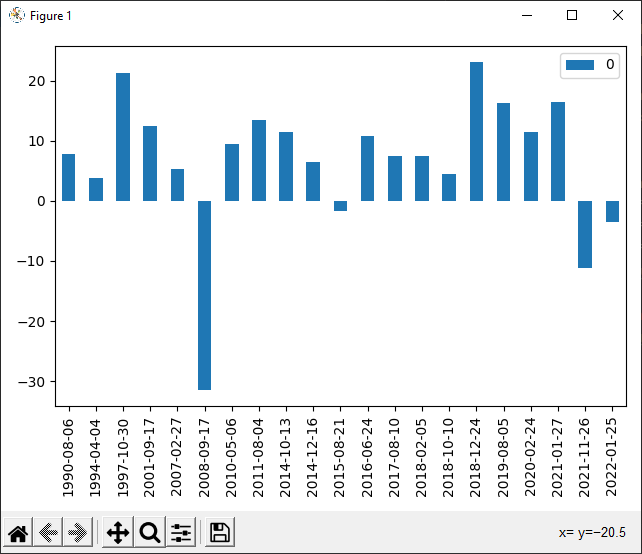

# JPMorgan_VIX_SP500

Реализация стратегии JPMorgan VIX/S&P500

Результат от 28.05.2022  
  

Индикатор показывает 100% точности за пределами рецессии.  

Из рисунка видно, поледние два сигнала имеют отрицательный процент доходности за полгода.  

26-11-2022 можно обьяснить рецессией.  
25-10-2022 возможно, доходность отрицательная из-за недостатка данных.  

Ссылка на оригинал статьи  
https://www.bloomberg.com/news/articles/2022-02-08/jpmorgan-strategists-see-sure-fire-sign-it-s-time-to-buy-stocks
